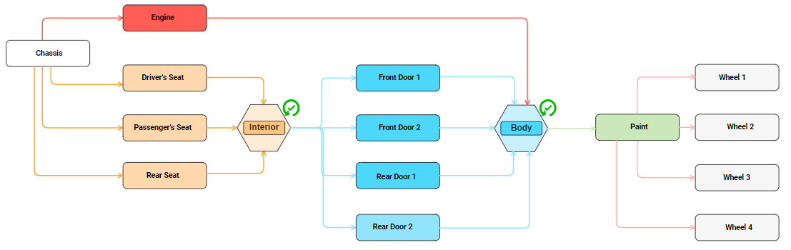

# lmax
 This small project features the concept of LMAX disruptor and its benefits. LMAX disruptor is an open-source
concurrency framework that allows very quick pass of events or messages between threads. 
It is a data structure that permits the work flow to go truly parallel. 

 To describe it very shortly, the disruptor has three main components: the Publisher, the RingBuffer 
and the EventProcessor:
* The Publisher pushes events to the RingBuffer.
* The RingBuffer is a circular array for storing the data.
* The EventProcessor read events from the RingBuffer.

 The example used in the project is a car factory and the components of the car are 
installed in a parallel fashion. This use case outlines how the disruptor helps us 
in a multi-threading environment and why it is useful.

 The workflow implemented was established by the following diagram:

 
 
  Basically, imagine that the axis of time is from left to right. So any car parts (rounded rectangles) 
 that are vertically aligned with one another can be assembled in parallel.  
 This may look like it would take some work to write such code for this parallel environment, 
 but actually it is not that complicated! 
 The following code snippet defines which EventProcessors (also called consumers) can run
 in parallel by placing the consumers in the same call of the "then()" method as follows:
 ```
  disruptor.handleEventsWith(engineConsumer)
                 .and(disruptor.handleEventsWith(driverSeatConsumer, passengerSeatConsumer, rearSeatConsumer)
                 .then(frontDoorTwoConsumer, frontDoorOneConsumer, rearDoorOneConsumer, rearDoorTwoConsumer))
                 .then(paintConsumer)
                 .then(wheelOneConsumer, wheelTwoConsumer, wheelThreeConsumer, wheelFourConsumer)
                 .then(qualityAssuranceConsumer);
 ```
 
  Notice the "and()" call and the beginning. It was implemented in this manner in order to make the paintConsumer wait for both
 the engineConsumer and the other 7 consumers in which the first three driverSeatConsumer, passengerSeatConsumer and rearSeatConsumer
 run in parallel and then after all three finish, frontDoorTwoConsumer, frontDoorOneConsumer, rearDoorOneConsumer and rearDoorTwoConsumer
 run in parallel as well. After the paintConsumer finishes, another 4 consumers run in parallel and after all 4 finish, the last
 consumer sums up all that was assembled and sends the resulting event into a second disruptor.
 
  The reason the second disruptor exists is because we want to send cars as soon as they finish so again we use 
 a disruptor to publish our finished cars in them, and another consumer called responseHandler will read those events asynchronously 
 and send them back to the client who requested it.
 
  Having successfully tested this implementation with thousands of requests, we concluded that the approach behaved 
 as we wanted it to, into a fully parallel manner.  
 
 
  
 
 
 
 
 
 
